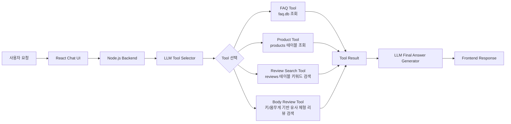
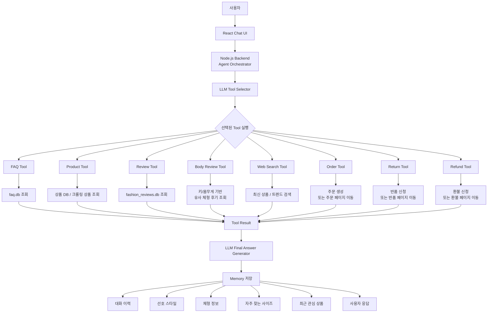

# 온라인 의류 쇼핑 상담 AI Agent

## 1. 프로젝트 개요

본 프로젝트는 35~50대 여성 소비자의 온라인 의류 쇼핑 과정에서 발생하는 불편함을 줄이기 위한 **온라인 의류 쇼핑 상담 AI Agent**입니다.

사용자는 채팅창에 자연어로 질문을 입력할 수 있으며, AI Agent는 질문 의도를 분석한 뒤 적절한 Tool을 선택하여 FAQ 데이터 또는 상품 리뷰 데이터를 기반으로 답변을 생성합니다.

예시 질문은 다음과 같습니다.

- 반품은 어떻게 신청해요?
- 배송은 언제 오나요?
- 키 160cm, 몸무게 50kg인데 여름 셔츠를 아방방하게 입고 싶어요. 어떤 사이즈가 좋을까요?
- 비슷한 체형의 사람들이 남긴 후기를 찾아줘
- 여름에 시원하게 입기 좋은 셔츠 추천해줘

---

## 2. 문제 정의

35~44세, 40~50대 여성들은 온라인 쇼핑 과정에서 다음과 같은 불편함을 겪을 수 있습니다.

- 앱 사용 시 글자가 잘 보이지 않아 정보 확인이 어려움
- 앱 내에서 주문, 배송, 교환, 반품, 환불 등 필요한 기능을 찾기 어려움
- 출산, 체형 변화 등으로 인해 기존 사이즈 선택 기준이 달라짐
- 여러 리뷰를 직접 읽고 나와 비슷한 체형의 후기를 찾는 과정이 번거로움

따라서 본 프로젝트는 AI Agent를 통해 사용자의 질문을 이해하고, 필요한 데이터를 찾아 쉬운 문장으로 요약하여 쇼핑 과정의 부담을 줄이는 것을 목표로 합니다.

---

## 3. 전체 설계

본 프로젝트는 **Tool Using Agent** 구조를 기반으로 설계했습니다.

```text
사용자 요청
→ LLM이 질문 의도 분석
→ 적절한 Tool 선택
→ Tool을 통해 DB 데이터 조회
→ 조회 결과를 LLM에 전달
→ LLM이 최종 답변 생성
→ 프론트엔드에 응답 반환
```

## 현재 Agent Pipeline


---

## 4. 데이터 수집 방식

본 프로젝트는 **AI Agent**가 답변에 활용할 수 있도록 두 종류의 데이터를 수집했습니다. 

1. FAQ 데이터
2. 상품 리뷰 데이터

### 4-1. FAQ 데이터 수집

**FAQ 데이터 선택 이유**

- 이유: FAQ는 자주 올라오는 질문을 모아두는 곳, FAQ에서 로그인 방식, 주문 언제오는지 등 쇼핑 할 때 겪는 문제에 대해 자주 올라오는 의문점을 올리는 곳으로 쇼핑 과정 중에 생기는 의문점을 쇼핑 과정 중 겪는 어려움으로 연결지을 수 있을 것 같아서 데이터를 얻어보려고 했다.

- posty 사이트에서 FAQ에 대한 데이터를 크롤링하여 데이터 수집 
- FAQ에 올라온 “카테고리/섹션별로” FAQ를 크롤링해서 faq.db에 저장 
- 카테고리 분류 이유: 주문,배송 관련 질문과 상품,문의 관련 질문 등 카테고리별 질문이 존재하고 카테고리 별로 데이터에 저장하면 질문이 들어왔을 때 키워드를 이용해서 질문에 대한 답변을 빠르게 찾을 수 있을 것 같아 카테고리 분류

**FAQ 크롤링 방식**
```text
Posty FAQ 카테고리 접근
→ 해당 카테고리 안의 섹션 목록 수집
→ 각 섹션별 FAQ article 목록 수집
→ 각 FAQ article 상세 내용 수집
→ 질문 제목과 답변 본문 추출
→ HTML 태그 제거 및 텍스트 정제
→ 질문 유형 분류
→ faq.db에 저장
```

**FAQ 카테고리 분류 방식**
```text
주문/결제:
주문, 결제, 카드, 무통장, 입금, 쿠폰, 포인트

배송:
배송, 택배, 출고, 송장, 운송장, 수령

교환/반품:
교환, 반품, 반송, 회수, 반품비, 오배송, 불량

취소/환불:
취소, 환불, 환급, 카드취소

상품문의:
상품, 사이즈, 색상, 소재, 핏, 기장, 비침, 품절, 재입고

계정/앱사용:
로그인, 회원, 비밀번호, 앱, 알림, 인증

리뷰:
리뷰, 후기, 작성, 수정, 삭제
```

### 4-2. 상품 리뷰 데이터 수집

**상품 리뷰 데이터 수집 이유**

-> 이유: 핏이나 사이즈 같은 문의가 들어왔을 때 FAQ에 있는 데이터 만으로 정보를 제공해줄 수 없어 상품 리뷰 데이터 수집했다.모든 상품과 모든 카테고리에 대한 리뷰를 크롤링하면 데이터 양이 커지고, MVP 단계에서는 관리하기 어렵다고 판단해 크롤링 범위를 줄였습니다.

- 퀸잇 사이트에서 여성 셔츠에 대해 상위 3개 제품에 대해 데이터를 수집
- 리뷰 데이터는 리뷰 문장 속 키워드를 기반으로 사이즈감, 기장감, 소재감을 분류함 
- 예시: "길어요", "길게", "기장이 길" → 길어요 / "시원", "얇", "가벼", "여름" → 시원함/가벼움 
- 키워드 별로 사이즈, 기장, 소개 분류 이유: 먼저 키워드 별로 카테고리를 분류했을 때 FAQ와 마찬가지로 문장 전체에 대해서 저장된 데이터를 참고하는 것 보다 키워드를 이용해 저장한 데이터를 참고하는 것이 더 빠르게 걸릴 것 같아 키워드를 카테고리별로 분류

**리뷰 데이터 분류 방식**

1. 사이즈감
2. 기장감
3. 소재감

**사이즈감 분류**

```text
작아요/타이트:
작아요, 작게, 타이트, 끼어요, 껴요, 딱 맞

커요/여유:
커요, 크게, 넉넉, 여유, 박시

정사이즈:
정사이즈, 잘 맞, 맞아요, 좋아요
```

**기장감 분류**

```text
길어요:
길어요, 길게, 기장이 길

짧아요:
짧아요, 짧게, 기장이 짧

적당함:
기장 좋아, 기장 적당, 길이 적당
```

**소재감 분류**

```text
시원함/가벼움:
시원, 얇, 가벼, 여름

탄탄함:
두꺼, 톡톡, 탄탄

비침 있음:
비침, 비쳐
```

---

## 5. Agent 동작 방식

```text
→ 사용자 질문
→ LLM 질문 의도 분석
→ Tool 선택
→ 선택된 Tool 실행
→ DB 데이터 조회
→ 조회 결과를 LLM에게 전달
→ 최종 답변 생성
→ 프론트엔드에 반환
```

---

## 6. 현재 구현된 Tool

### 6-1. FAQ Tool

FAQ Tool은 주문, 결제, 배송, 교환, 반품, 환불 등 정책성 질문에 답변을 하기 위해 사용됩니다.

예시 질문: 반품은 어떻게 신청해요?

### 6-2. Product Tool

Product Tool은 크롤링한 상품 정보를 조회를 위해 사용됩니다.

예시 질문: 셔츠 상품 추천해줘

### 6-3. Review Search Tool

Review Search Tool은 리뷰 키워드를 기반으로 착용 후기를 검색하기 위해 사용됩니다.

예시 질문: 소재가 시원한 후기 있어?

### 6-4. Body Review Tool

Body Review Tool은 사용자의 키와 몸무게를 기반으로 유사한 체형 리뷰를 검색하기 위해 사용됩니다.

예시 질문: 160cm 54kg이면 어떤 사이즈가 좋을까?

---

## 아쉬운 점

### 1. 프롬프트 설계의 아쉬움

현재의 질문 Agent는 사용자의 질문 의도를 세밀하게 반영하지 못하고 있습니다.

예시 질문: 저는 키 160cm, 몸무게 50kg이고 여름 셔츠를 아방방하게 입고싶은데 어떤 사이즈가 좋을까요?

질문 의도: S, M, L 중 어떤 사이즈를 선택해야 하는지 알고 싶음

프롬프트 개선 방향
- 사용자가 사이즈 선택을 묻는 경우 S/M/L/FREE 중 선택지를 명확히 답변
- 질문 의도를 “상품 추천”과 “사이즈 선택”으로 더 세밀하게 분리

### 2. 데이터 부족

현재의 Agent는 퀸잇 여성 셔츠 상위 3개 상품만 수집했습니다.

문제점
- 리뷰 수 적음
- 다양한 카테고리의 상품 추천이 어려움

해결
- 향후에는 다양한 상품과 리뷰 데이터를 수집하고, Vector DB를 활용해 검색의 성능을 높일 수 있습니다.

---

## 고도화 방향

## 고도화된 Agent 설계

향후에는 현재의 상담형 Agent를 실제 쇼핑 비서에 가까운 형태로 확장할 수 있습니다.  
사용자의 요청을 LLM이 분석하고, 필요한 Tool을 선택하여 데이터를 조회하거나 실제 행동을 수행하는 구조입니다.



**질문 예시**

사용자 질문: 반품해줘

```text
사용자 요청
→ LLM이 반품 요청으로 분류
→ 주문 정보 확인
→ 반품 가능 기간 확인
→ FAQ Tool로 반품 정책 확인
→ 사용자에게 반품 사유 확인
→ 최종 확인 후 반품 신청 또는 반품 페이지 이동
```
